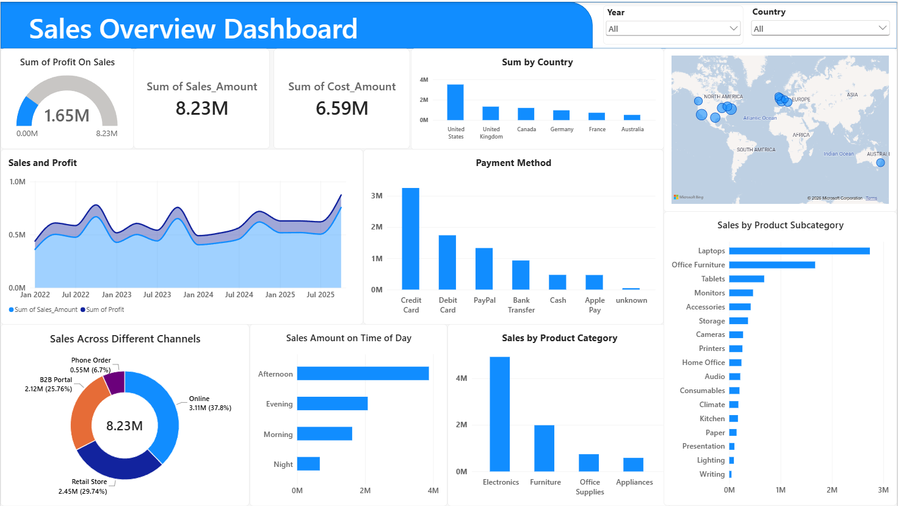
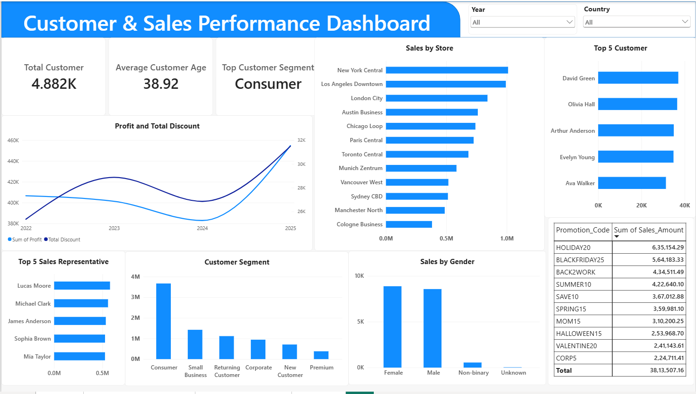
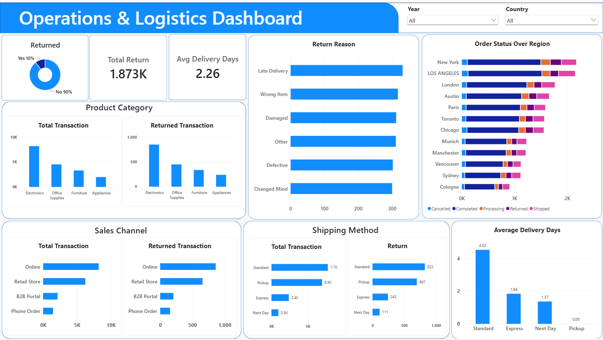

# Sales Performance Analysis & Dashboard Suite 📈

End-to-end analysis of 18,000+ sales transactions (2022–2025) across 6 countries,
from advanced data cleaning in Python to a 3-page interactive Power BI dashboard
covering sales, customer behavior, and operations.

## 📌 Objective
- Clean and standardize a large, messy real-world transactional dataset
- Analyze sales trends, customer behavior, returns, and operational performance
- Build a multi-page dashboard for different stakeholders (sales, customer insights, operations)

## 🛠️ Tools & Libraries
- **Python**  Pandas, NumPy, Matplotlib, Seaborn (cleaning, feature engineering, EDA)
- **Power BI**  3-page interactive dashboard

## 🧹 Data Cleaning & Feature Engineering (Python)
- Handled missing values using **context-aware imputation** rather than global fills:
  - Customer details (`Name`, `Age`, `Gender`) backfilled/forward-filled **per Customer_ID**, since the same customer should be consistent across orders
  - `Delivery_Days` filled with the **median per Shipping_Method**
  - `Inventory_Level` filled with the **median per Store + Product**
  - `Customer_Rating` filled with the **median per Product**
  - `Customer_Age` filled with the median **per Customer_Segment**
- Enforced logical consistency: `Return_Reason` only populated where `Return_Flag == "Yes"`
- Standardized inconsistent categorical values (casing/spelling errors in Payment Method, Product Category, Gender)
- Parsed date/time fields into `Order_Date`, `Hour`, `Time_of_Day` (Night/Morning/Afternoon/Evening) bins
- Removed duplicate transactions
- Exported the cleaned dataset to Excel for use in Power BI

## 📊 Key Findings (Python EDA)

| Question | Finding |
|---|---|
| Top market | **United States** holds the majority of sales; Australia the least |
| Most used payment method | **Credit Card**, followed by Debit Card and PayPal |
| Peak transaction time | **Afternoon**, followed by Evening; Night is lowest |
| Return rate | **10.4%** of all sales are returned — a meaningful figure worth investigating |
| Top return reason | **Late Delivery**, though all reasons are fairly close in volume |
| Shipping vs. returns | Return rate tracks transaction volume per shipping method proportionally — shipping method itself isn't driving returns |
| Best-selling category | **Electronics** — highest in both revenue and transaction count |
| Most profitable category | **Electronics**, followed by Furniture; Office Supplies and Appliances lag behind |
| Customer demographics | Transactions skew slightly female over male; Non-binary and Unknown are a small share |
| Dominant sales channel | **Online**, followed by Retail Store |
| Yearly trend | Sales dipped in 2024 and rebounded strongly in 2025 |
| Profit vs. discount | Trend lines move together over time — discounting appears linked to higher profit, not just higher volume |

## 📈 Power BI Dashboard (3 pages)

### Sales Overview

Global sales map, profit/cost KPIs, sales by country, payment method, and category breakdowns.

### Customer & Sales Performance

Customer segments, top customers and sales reps, promotion code performance, and sales by store/gender.

### Operations & Logistics

Return rates and reasons, delivery performance by shipping method, and sales-channel-level return tracking.

> 💡 Download `sales_dashboard.pbix` and open it in
> [Power BI Desktop](https://powerbi.microsoft.com/desktop/) (free) to explore the
> dashboard interactively with live filters.

## 🚀 How to Run the Analysis
```bash
git clone https://github.com/jobinjosej253/sales-performance-dashboard.git
cd sales-performance-analysis
pip install pandas numpy matplotlib seaborn scikit-learn openpyxl
jupyter notebook notebooks/sales_dataanalysis.ipynb
```

## 📂 Repo Structure
```
├── Sales_transactions_2022_2025.csv
├── Sales_data.xlsx
├── sales_dataanalysis.ipynb
├── sales_dashboard.pbix
├── images/
│ ├── SalesOverview.png
│ ├── Customer&SalesPerformance.png
│ └── Operations&Logistics.png
└── README.md
```

## 📄 License
MIT
